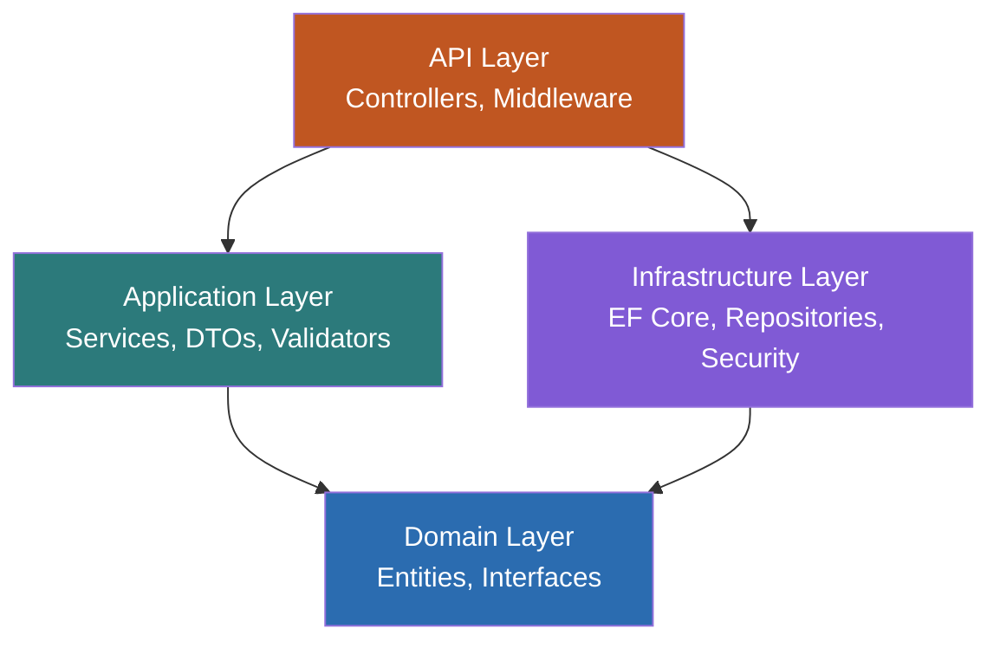
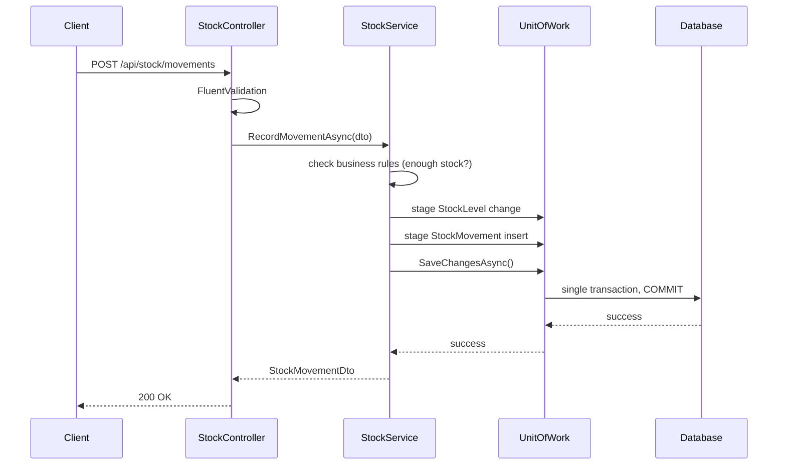
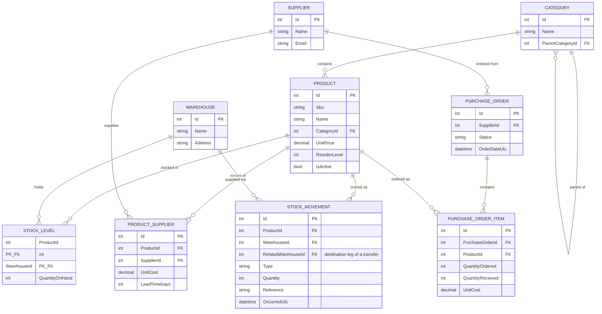

# Inventory & Warehouse Management System — Architecture

## 1. Overview

This document describes the architecture of the Inventory & Warehouse Management System: a backend built with C#, ASP.NET Core, and SQL Server, plus a React frontend on top of it. The system tracks products, stock levels across multiple warehouses, stock movements, suppliers, and purchase orders.

The architecture follows **Clean Architecture** (also known as Onion Architecture): dependencies always point inward, toward the domain, and outer layers depend on abstractions defined by inner layers rather than the other way around. This keeps business logic independent of frameworks, databases, and UI, and makes the system easier to test and extend.

## 2. Solution Structure

```
InventorySystem/
├── src/
│   ├── InventorySystem.Domain/
│   │   ├── Entities/            (Product, Category, Warehouse, StockMovement, User, ...)
│   │   ├── Enums/                (MovementType, PurchaseOrderStatus, UserRole)
│   │   ├── Interfaces/           (IRepository<T>, IUnitOfWork, IStockLevelRepository,
│   │   │                          IUserRepository, IReportRepository, IPasswordHasher,
│   │   │                          IJwtTokenGenerator)
│   │   ├── Reporting/            (StockValuationRow, MovementHistoryRow - query projections)
│   │   └── Exceptions/           (DomainException, InsufficientStockException,
│   │                              AuthenticationException)
│   │
│   ├── InventorySystem.Application/
│   │   ├── Services/              (ProductService, StockService, PurchaseOrderService,
│   │   │                           ReportService, AuthService, ...)
│   │   ├── Interfaces/            (IProductService, IStockService, ...)
│   │   ├── DTOs/                  (ProductDto, StockMovementDto, PagedResult<T>, ...)
│   │   ├── Validators/            (FluentValidation rules)
│   │   └── Mappings/              (AutoMapper profile - entity to DTO only)
│   │
│   ├── InventorySystem.Infrastructure/
│   │   ├── Persistence/
│   │   │   ├── AppDbContext.cs
│   │   │   ├── AppDbContextSeed.cs
│   │   │   ├── Configurations/    (EF Core Fluent API entity configs)
│   │   │   ├── Migrations/
│   │   │   └── Repositories/      (generic Repository<T>, plus StockLevelRepository,
│   │   │                           UserRepository, ReportRepository, UnitOfWork)
│   │   └── Security/               (PasswordHasher, JwtTokenGenerator, JwtSettings)
│   │
│   └── InventorySystem.API/
│       ├── Controllers/           (ProductsController, StockController, ReportsController, ...)
│       ├── Middleware/            (ExceptionHandlingMiddleware)
│       ├── Program.cs
│       └── appsettings.json
│
├── tests/
│   ├── InventorySystem.UnitTests/        (service and business logic tests, Moq)
│   └── InventorySystem.IntegrationTests/ (WebApplicationFactory + a real LocalDB instance)
│
└── frontend/                     (React 19 + TypeScript + Vite)
    └── src/
        ├── api/                   (types.ts mirrors the DTOs; client.ts is the auth-aware
        │                           fetch wrapper; endpoints.ts groups calls by resource)
        ├── auth/                  (AuthContext, RequireAuth route guard)
        ├── components/            (Layout, Modal, DataTable-ish table markup, StatusBadge)
        ├── hooks/useAsync.ts       (shared load/error/reload state for every page)
        └── pages/                 (one per resource, plus Dashboard/Login/PO detail)
```

## 3. Layer Responsibilities

**Domain layer** — the core of the system. Contains entities (plain C# classes; `Product` carries constructor validation and behavior methods rather than bare setters, as the one deliberate departure from an otherwise anemic style), enums, domain exceptions, and the repository/security interfaces that Infrastructure implements. Has no dependency on any other layer or external package — not even EF Core. This is what would remain if you swapped ASP.NET Core for a console app or SQL Server for another engine.

**Application layer** — orchestrates use cases. Contains services that implement business rules (e.g., "transferring stock between warehouses must be atomic and must not allow negative stock"), DTOs used to move data across boundaries, validation rules, and the AutoMapper profile. Depends only on the Domain layer's interfaces, never on Infrastructure or API directly — this is what makes the business logic testable without a real database. Notably, it has no package reference to EF Core at all: `IRepository<T>` exposes eager-loading via plain dotted-path strings (e.g. `"Items.Product"`) rather than `IQueryable`/`Include`, specifically so Application never needs to know EF Core exists.

**Infrastructure layer** — implements the interfaces defined in Domain. Contains the EF Core `DbContext`, entity configurations, migrations, concrete repository/unit-of-work implementations, password hashing, and JWT issuance. This is the only layer that knows about EF Core, SQL, or connection strings.

**API layer** — the entry point. Thin controllers that validate input, call Application services, and return DTOs. Handles cross-cutting concerns like JWT authentication, global exception handling, and Swagger. Depends on Application and Infrastructure only to wire them up via dependency injection in `Program.cs` — it contains no business logic itself.

## 4. Dependency Flow



Domain has no outgoing arrows — everything depends on it, it depends on nothing. Infrastructure depends on Domain (to implement its interfaces) but Domain never references Infrastructure. This inversion is what lets the Application layer's services be unit-tested with a mocked `IUnitOfWork` instead of a real database (see `tests/InventorySystem.UnitTests`).

## 5. Design Patterns Used

**Repository + Unit of Work** — most entities share a single generic `Repository<T>`, since their access patterns (get by id, get all, add, update, remove) are identical. Two entities got dedicated repositories instead: `StockLevel` (composite `ProductId`/`WarehouseId` key, so `GetByIdAsync(int id)` doesn't fit) and `User` (needs lookup by username, not id). `IUnitOfWork` wraps `SaveChangesAsync` and coordinates multiple repository operations inside a single database transaction — this is what guarantees a stock transfer updates two warehouse balances atomically or not at all.

**Dependency Injection** — all services and repositories are registered in `Program.cs` (Infrastructure/API concerns) and `Application.DependencyInjection.AddApplication()` (Application services, validators, AutoMapper), injected via constructor.

**DTO + AutoMapper** — entities never leave the Application layer directly; controllers return DTOs. AutoMapper is used only for the entity→DTO read direction; create/update DTOs are turned into entities by the services themselves, through domain constructors and behavior methods rather than blind property copying.

**Options pattern** — configuration (JWT signing key/issuer/audience) is bound to a strongly typed `JwtSettings` class via `IOptions<JwtSettings>`, resolved lazily rather than read eagerly at startup (see §10 for why that distinction mattered in practice).

**Global exception handling middleware** — domain exceptions are caught centrally in `ExceptionHandlingMiddleware` and translated into consistent JSON error responses, instead of try/catch blocks in every controller action.

## 6. Request Lifecycle (Example: Recording a Stock Movement)



If the stock check fails, `InsufficientStockException` is thrown before anything is added to the change tracker, so `SaveChangesAsync` is never reached and nothing is written — the middleware converts it into a `409 Conflict` with a clear message. A stock **transfer** works the same way but stages two movements (one `Out` at the source warehouse, one `In` at the destination, sharing a correlating `Reference`) before the single `SaveChangesAsync`; receiving a purchase order stages one movement per line item plus the order's own status update, all committed together for the same reason.

## 7. Database Design



`StockLevel` uses a composite key (`ProductId`, `WarehouseId`) rather than a surrogate key, since a product's quantity at a given warehouse is a single fact, not an entity with its own identity. `StockMovement` is an append-only ledger — it is never updated or deleted, only inserted — so the current `StockLevel` can always be reconciled against movement history. A separate `User` table (`Id`, `Username`, `PasswordHash`, `Role`) backs authentication; it isn't shown above since it has no relationship to the inventory graph.

## 8. Cross-Cutting Concerns

**Validation** — FluentValidation rules run in controllers (via `IValidator<T>.ValidateAndThrowAsync`) before a service touches the database, keeping validation logic out of both controllers and entities themselves.

**Transactions** — any operation touching more than one row that must succeed or fail together (stock transfer, receiving a purchase order) stages every change first and calls `SaveChangesAsync` exactly once, so EF Core's own transaction wraps it all. See §6 and the Phase 5/6 commit history for the concrete failure-path testing this was verified against.

**Authentication & Authorization** — JWT bearer authentication, with role-based policies (`Admin`, `Manager`, `Staff`). Every endpoint requires an authenticated caller by default (a global `AuthorizationOptions.FallbackPolicy`), except `POST /api/auth/login` which is explicitly `[AllowAnonymous]`. Only `Admin` and `Manager` roles can delete a product/category/warehouse/supplier; any authenticated role can read.

**Logging** — ASP.NET Core's built-in `ILogger<T>`, used by `ExceptionHandlingMiddleware` to log unhandled exceptions at `Error` and handled/expected ones (validation failures, business-rule rejections) at `Warning`, so a 500 stands out from an expected 400/404/409 in the logs without a separate logging library.

**Error handling** — a single exception-handling middleware maps the exception vocabulary built up across Domain/Application into HTTP status codes: `FluentValidation.ValidationException` → 400 with per-field errors, `InsufficientStockException` → 409, other `DomainException` → 400, `AuthenticationException` → 401, `KeyNotFoundException` → 404, anything else → 500 (logged, never leaked to the client).

## 9. API Design

RESTful conventions over resources: `/api/products`, `/api/categories`, `/api/warehouses`, `/api/suppliers`, `/api/purchaseorders`, `/api/stock/movements`, `/api/stock/transfers`, `/api/reports/*`, `/api/auth/login`. Swagger/OpenAPI (via Swashbuckle) is generated for documentation and manual testing, with a Bearer-token security scheme wired in so a token from `/api/auth/login` can be used directly from the Swagger UI. Pagination, search, and sorting are supported on the product list endpoint (`?page=&pageSize=&search=&sortBy=`) to demonstrate filtered/paged querying rather than loading the entire table for every request.

Enums serialize as their string name (`"type": "In"`, not `0`) via a global `JsonStringEnumConverter` - added once the frontend became a real consumer of this API and "what does `type: 1` mean" stopped being a rhetorical question. `HasConversion<string>()` on the EF Core side (§7) is a separate, unrelated decision about the database column, not the wire format; nothing keeps the two in sync automatically, they just happen to agree.

A named CORS policy exists for local frontend development that bypasses its proxy (`npm run dev` pointed straight at the API's own origin), but it's a fallback: both the Vite dev server and the frontend's nginx container proxy `/api/*` to the API, so the browser sees everything as same-origin in the normal case and CORS is never actually exercised.

## 10. Testing Strategy

Unit tests target the Application layer's services using a mocked `IUnitOfWork` (Moq), so business rules like "cannot transfer more stock than is on hand" and "a rejected movement writes nothing" are verified without touching a real database — including entity-level assertions (the in-memory `StockLevel.QuantityOnHand` is provably unchanged after a rejected transfer, not just "SaveChangesAsync was never called").

Integration tests use `WebApplicationFactory<Program>` against a **dedicated LocalDB database** (`InventorySystemDb_IntegrationTests`, recreated per run via `EnsureDeleted`/`Migrate`) rather than an in-memory or SQLite provider. That's a deliberate deviation from the more common "in-memory or Testcontainers" advice: the app relies on genuine SQL Server behavior in a couple of places — the movement-history report casts `Database.GetDbConnection()` to `SqlConnection` and hand-writes T-SQL (`OFFSET`/`FETCH`), and several columns use `HasConversion<string>()` — so a different provider would either fail outright or silently diverge from what actually runs in dev/prod. LocalDB needs no Docker and is fast to recreate per test run.

Getting `WebApplicationFactory` to work with the minimal-hosting `Program.cs` surfaced a real gotcha worth documenting: the app originally read `JwtSettings` eagerly (`builder.Configuration.GetSection("Jwt").Get<JwtSettings>()`) before `builder.Build()`. `WebApplicationFactory` injects its configuration overrides for minimal-hosting apps around the `Build()` call itself, so that eager read never saw the test's overrides and startup failed. Fixed by binding `JwtBearerOptions` from `IOptions<JwtSettings>` lazily instead, which only reads configuration on first actual use.

The critical flow — create product → record stock in → verify the level via `GET` — plus the negative/atomic case (an over-drawn `Out` movement rejected with the level left unchanged) and the auth guarantees (401 unauthenticated, 403 wrong role) are all covered at this HTTP level, not just via service mocks.

## 11. Deployment

The API, database, and frontend are all containerized with Docker; `docker-compose.yml` at the repo root runs three services - SQL Server 2022, the API, and the frontend (a multi-stage build: `npm run build` in a Node stage, then the static output served by nginx, which also reverse-proxies `/api/*` to the API container) - so the whole system starts with a single `docker compose up --build`. The API applies pending EF Core migrations and seeds demo data automatically on startup (with a short retry loop, since the SQL Server container's healthcheck passing doesn't guarantee it's instantly ready for connections) — no `dotnet ef database update` or manual seeding step required.

## 12. Key Architectural Decisions

- **Clean Architecture over a simple 3-tier split**: chosen so business rules stay testable and framework-independent, at the cost of a bit more boilerplate — a reasonable trade-off for a project meant to demonstrate architectural understanding.
- **Repository + Unit of Work over direct `DbContext` injection into services**: makes the Application layer's business logic unit-testable without a real database, and keeps a clear seam if the persistence technology ever changed.
- **Append-only `StockMovement` ledger over mutable stock history**: gives a full audit trail and makes stock levels reconstructable/verifiable, which matters in any real inventory system.
- **DTOs at the API boundary over exposing entities directly**: prevents over-posting vulnerabilities and decouples the public API contract from internal database schema changes.
- **String-path eager loading (`"Items.Product"`) over `IQueryable`/`Include` in the repository interface**: keeps the Application layer free of any EF Core package reference, at the cost of losing compile-time checking on the navigation path.
- **Splitting `StockService.RecordMovementAsync` into a stage-only primitive plus a save-wrapping public method**: needed once `PurchaseOrderService.ReceiveAsync` had to call it once per line item — without the split, a multi-line receipt would commit each line's stock movement independently, so a bad line 3 of 5 would leave lines 1–2 already committed instead of the whole receipt failing atomically.
