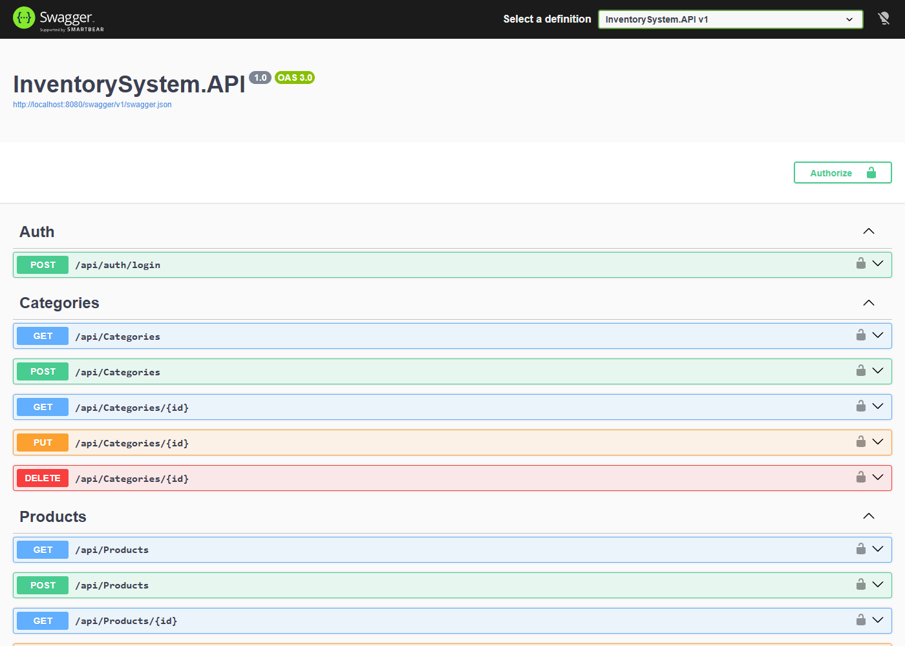
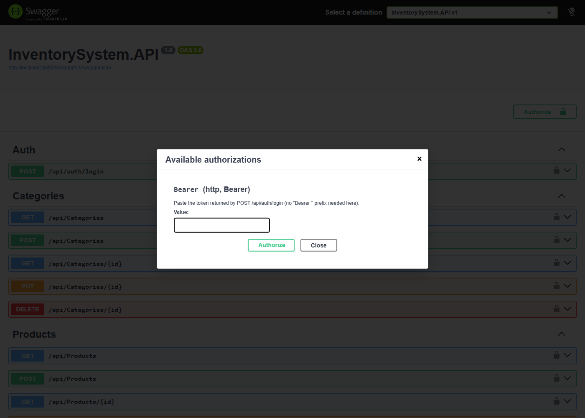
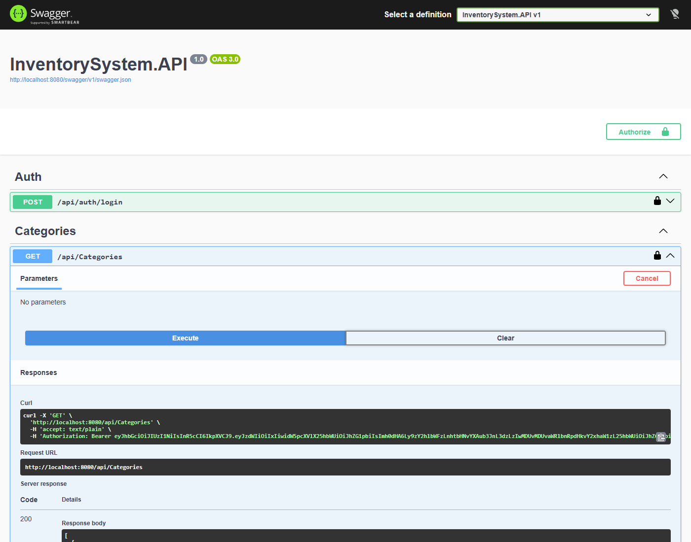
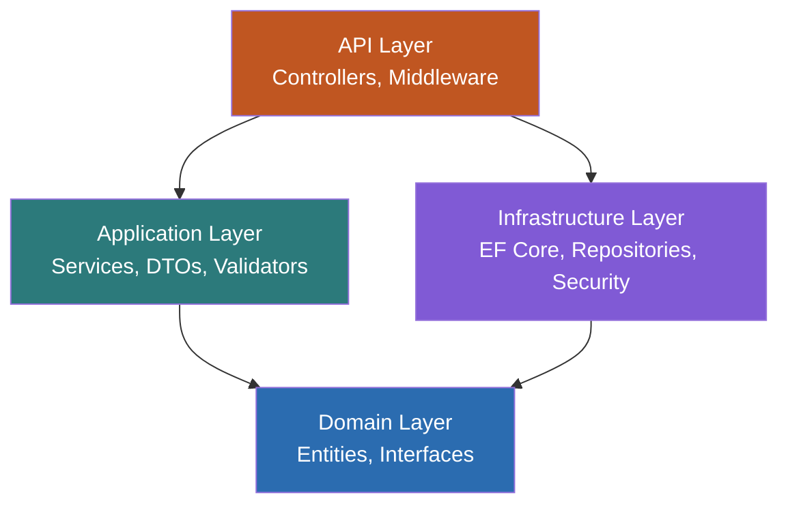
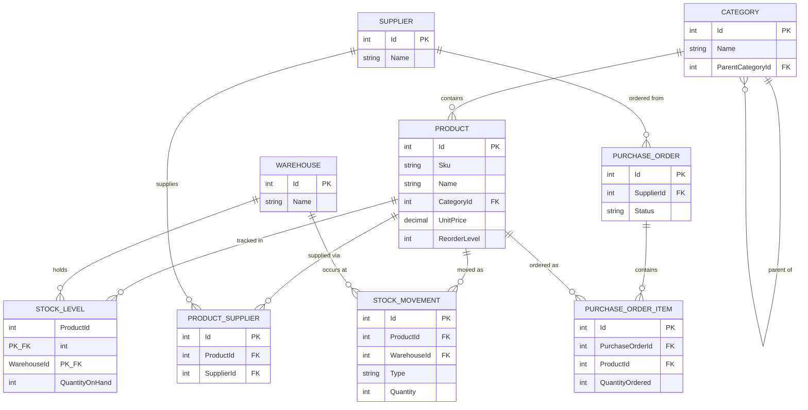

# Inventory & Warehouse Management System

A backend inventory management API built with ASP.NET Core and SQL Server, using Clean Architecture. It tracks products, stock levels across multiple warehouses, stock movements (in/out/transfer), suppliers, and purchase orders, with JWT authentication and role-based authorization.

Full design rationale, the dependency-flow diagram, the ER diagram, and the request-lifecycle sequence diagram live in **[ARCHITECTURE.md](ARCHITECTURE.md)**.

## Quick start

```bash
git clone <this-repo-url>
cd Inventory
docker compose up --build
```

That's it — no local .NET SDK, no manual `dotnet ef database update`, no manual seeding. On first run the API container waits for SQL Server to become healthy, applies EF Core migrations, and seeds demo data automatically. Give it 30–60 seconds after the containers report healthy for the migration/seed step to finish, then:

- Swagger UI: **http://localhost:8080/swagger**
- API base URL: **http://localhost:8080**

Log in with one of the seeded demo accounts (see [Demo accounts](#demo-accounts) below), click **Authorize** in Swagger, paste the token, and every endpoint is live.

To stop everything: `docker compose down` (add `-v` to also drop the database volume).

### Try it in 30 seconds without opening Swagger

A ready-to-run request collection is committed at [`requests/InventorySystem.http`](requests/InventorySystem.http) — login, create a product, record stock, attempt an over-draw (see the 409 rejection), transfer stock between warehouses, pull the reports, and run a full purchase-order lifecycle. Works with the VS Code **REST Client** extension, JetBrains' built-in HTTP client, or Visual Studio 2022's built-in `.http` support — open the file and click "Send Request" top to bottom.

## Tech stack

| Layer | Technology |
|---|---|
| API | ASP.NET Core 10, Swashbuckle (Swagger/OpenAPI) |
| Auth | JWT bearer tokens, hand-rolled PBKDF2-SHA256 password hashing |
| Application | FluentValidation, AutoMapper |
| Data access | Entity Framework Core 10 (SQL Server), plus hand-written parameterized ADO.NET for one report |
| Database | SQL Server 2022 (LocalDB for local dev, containerized for `docker compose`) |
| Testing | xUnit, Moq (unit), `WebApplicationFactory` against a real database (integration) |
| Containerization | Docker, multi-stage Dockerfile, docker-compose |

## Demo accounts

Seeded automatically on first run (see `AppDbContextSeed`):

| Username | Password | Role |
|---|---|---|
| `admin` | `Admin123!` | Admin — full access, including delete |
| `manager` | `Manager123!` | Manager — full access, including delete |
| `staff` | `Staff123!` | Staff — read/create/update, **not** delete (try it — you'll get a 403) |

## What's implemented

- **Catalog CRUD** — Products, Categories, Warehouses, Suppliers, with pagination/search/sort on the product list (`?page=&pageSize=&search=&sortBy=`).
- **Stock movements** — record `In`/`Out`/`Adjustment` movements per warehouse, and warehouse-to-warehouse transfers modeled as one `Out` leg + one `In` leg committed atomically. An over-drawn `Out` (or transfer) is rejected with `409 Conflict` and **nothing is written** — no partial state, verified at both the unit-test and live-database level.
- **Purchase orders** — draft → send → receive lifecycle; receiving a PO stages one stock movement per line item and commits them together with the order's own status update in a single transaction.
- **Reporting** — low-stock, stock valuation (grouped by warehouse or category), and a filtered/paginated movement history. The valuation reports run through EF Core LINQ; movement history is deliberately hand-written parameterized ADO.NET (`SqlCommand`/`SqlDataReader`, dynamic `WHERE`, a three-table `JOIN`, SQL Server `OFFSET`/`FETCH` pagination) to demonstrate direct SQL, not just ORM reliance.
- **Auth** — JWT bearer tokens, three roles (`Admin`, `Manager`, `Staff`). Every endpoint requires authentication by default; only `Admin`/`Manager` can delete.
- **Tests** — unit tests mock `IUnitOfWork` with Moq to verify business rules (insufficient-stock rejection, transfer atomicity) without a database; integration tests boot the real API via `WebApplicationFactory<Program>` against a real (LocalDB) database and exercise full HTTP request/response cycles.

## Screenshots

Swagger UI, taken from a live `docker compose up` run:

**Endpoint list, grouped by controller**


**Bearer token authorization**


**A live authorized call and its response**


## Architecture at a glance

Clean Architecture: dependencies point inward, toward Domain, which has no dependency on anything else — not even Entity Framework.



### Entity-relationship diagram



`StockLevel` uses a composite key (`ProductId`, `WarehouseId`); `StockMovement` is an append-only audit ledger. Full details, plus a `User`/roles note and the reasoning behind each decision, are in [ARCHITECTURE.md](ARCHITECTURE.md).

## Running without Docker

Requires the .NET 10 SDK and either SQL Server LocalDB (Windows) or a reachable SQL Server instance.

```bash
dotnet restore
dotnet ef database update -p src/InventorySystem.Infrastructure -s src/InventorySystem.API
dotnet run --project src/InventorySystem.API
```

Connection string and JWT settings live in `src/InventorySystem.API/appsettings.Development.json`.

## Running the tests

```bash
dotnet test
```

Runs both the unit test suite (mocked `IUnitOfWork`, no database) and the integration suite (spins up a dedicated LocalDB database via `WebApplicationFactory`, migrates it, seeds it, and tears it down afterward — no Docker required for this, but it does need SQL Server LocalDB installed).
